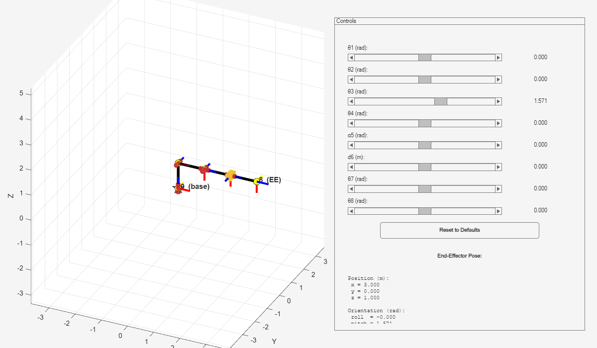

# DH Visualizer

[Back to the repository overview](../README.md)

The DH runner converts a standard Denavit-Hartenberg table into an interactive
3D robot. Every parameter marked as variable gets a slider; moving a slider
recomputes the complete forward-kinematics chain and updates the end-effector
position and orientation immediately.



_Default pose of `example.mlx`. Red cylinders indicate revolute joints, the
gold square prism indicates a prismatic joint, and the black segments are the
links._

## Quick start

From the repository root in MATLAB:

```matlab
addpath("DH")
open("DH/example.mlx")
```

Run the live script, or create a robot directly:

```matlab
joints = {
    {struct('value', 0, ...
            'variable', true, ...
            'type', 'rotation', ...
            'range', [-pi pi]), 0.4, 0.7, 0}, ...
    {struct('value', 0, ...
            'variable', true, ...
            'type', 'rotation', ...
            'range', [-pi pi]), 0, 0.6, 0}, ...
    {0, struct('value', 0.2, ...
               'variable', true, ...
               'type', 'translation', ...
               'range', [0 0.5]), 0, 0}
};

dh_table = create_dh_table(joints);
display_dh_table(dh_table);
run_dh_visualizer(dh_table, true);
```

This example creates an RRP robot with two revolute joints and one prismatic
joint. The final `true` selects the cleaner plot without numbered axis labels.

## Define the DH table

`create_dh_table` expects an outer cell array with one inner cell per joint.
Every joint must contain exactly four entries in this order:

```text
{theta_i, d_i, a_i, alpha_i}
```

The implementation uses the standard DH transform:

```text
A_i = RotZ(theta_i) * TransZ(d_i) * TransX(a_i) * RotX(alpha_i)
T_0_i = A_1 * A_2 * ... * A_i
```

Use a number for a fixed parameter and a structure for a configurable
parameter:

| Form | Meaning |
| --- | --- |
| `0.5` | Fixed parameter with value `0.5` |
| `struct('value', 0)` | Variable parameter using defaults inferred from its DH column |
| `struct('value', 0, 'range', [-pi/2 pi/2])` | Variable parameter with a custom slider range |

A variable structure supports these fields:

| Field | Required | Behavior |
| --- | --- | --- |
| `value` | Yes | Initial value and the value restored by **Reset to Defaults** |
| `variable` | No | Defaults to `true`; only true parameters receive sliders |
| `type` | No | `rotation` or `translation`; defaults to the natural type of the DH column |
| `range` | No | Two-element `[min max]` slider range |

Default ranges are `[-2*pi, 2*pi]` for rotation and `[-2, 2]` for
translation. The UI labels rotations in radians and translations in metres.
The initial `value` must lie inside its range.

Although a conventional revolute joint varies `theta` and a conventional
prismatic joint varies `d`, the interactive runner allows any of
`theta`, `d`, `a`, or `alpha` to be variable. Parameters are named
automatically from their row and column, such as `θ2`, `d3`, or `α5`.

## Use the visualizer

```matlab
run_dh_visualizer(dh_table);        % show numbered x_i and z_i axis labels
run_dh_visualizer(dh_table, true);  % suppress those labels for a cleaner view
```

The window provides:

- One continuously updating slider and numeric readout for every variable
  parameter.
- A reset button that restores all values from the original DH table.
- Black links and a marker at every frame origin.
- Red X and blue Z axes at every frame. The yellow Y axis is shown only at the
  base and end effector to reduce clutter.
- Red cylindrical markers for inferred revolute joints and gold square markers
  for inferred prismatic joints.
- End-effector position `[x, y, z]` in metres and orientation
  `[roll, pitch, yaw]` in radians. The angles are extracted using a ZYX
  yaw-pitch-roll decomposition and displayed in roll, pitch, yaw order.

The plot limits are estimated once from the configured parameter ranges and
then held fixed, so the robot does not appear to change scale while it moves.
A joint is drawn as prismatic when it has a variable parameter typed as
`translation` and no variable parameter typed as `rotation`; otherwise it
is drawn as revolute. This marker choice affects only the drawing, not the DH
transform.

## Animate a trajectory

`animate_dh_motion` plays a sampled joint-space trajectory in a separate,
simpler figure:

```matlab
samples = 150;
trajectory = [ ...
    linspace(0, pi/2, samples).', ...
    linspace(0, -pi/3, samples).', ...
    linspace(0.2, 0.4, samples).' ...
];
time = linspace(0, 5, samples);

animate_dh_motion(dh_table, trajectory, time);
```

This helper assumes exactly one active coordinate per joint and therefore
expects `trajectory` to have one column per joint. It updates `theta` for
an inferred revolute joint and `d` for an inferred prismatic joint. Use the
interactive runner instead when a row varies `a` or `alpha`, contains
multiple variable parameters, or does not represent one active coordinate.
If the time vector is omitted, the helper creates one assuming 30 samples per
second.

## Files

| File | Role |
| --- | --- |
| [`example.mlx`](example.mlx) | Included eight-joint live example |
| [`create_dh_table.m`](create_dh_table.m) | Validates and normalizes fixed and variable DH parameters |
| [`display_dh_table.m`](display_dh_table.m) | Prints the normalized table and slider ranges |
| [`run_dh_visualizer.m`](run_dh_visualizer.m) | Interactive 3D forward-kinematics window |
| [`animate_dh_motion.m`](animate_dh_motion.m) | Sampled trajectory playback |

## Common errors

- **Undefined function:** run `addpath("DH")`, or make `DH/` the current
  MATLAB folder.
- **Each joint must have exactly 4 DH parameters:** keep every row in
  `{theta, d, a, alpha}` order.
- **No variable parameters found:** define at least one parameter as a
  structure with `variable` set to `true`.
- **Slider value error:** make sure each initial `value` is between the two
  values in its `range`.

The runner is a forward-kinematics visualizer. It does not compute inverse
kinematics, dynamics, collisions, joint torques, or commands for physical
hardware.
