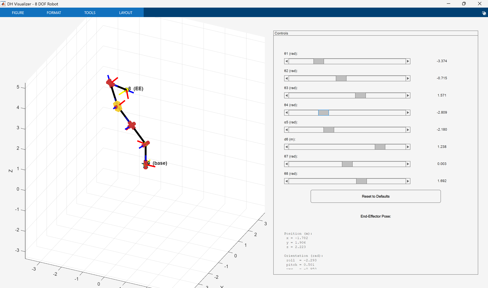

# IELET2107 Robotics

A  MATLAB workspace for robotics exercises, with an interactive
Denavit-Hartenberg (DH) visualizer and controller. Define a robot as a DH
table, move every variable parameter with a slider, and observe the resulting
links, coordinate frames, and end-effector pose in 3D.



_The included eight-joint example after moving its revolute, prismatic, and
variable twist parameters._

## Repository at a glance

| Path | Contents | Start here |
| --- | --- | --- |
| [`DH/`](DH/) | Flexible DH-table creation, terminal output, interactive forward-kinematics visualization, and a trajectory animation helper | [DH usage guide](DH/README.md) |
| [`SCARA_DYN/`](SCARA_DYN/) | A separate three-DOF SCARA dynamics example with PD control, `ode45`, and rigid-body-tree animation | [SCARA guide](SCARA_DYN/README.md) |
| [`eksamen2023/`](eksamen2023/) | NTNU 2023 exam exercises, figures, and expandable answer notes | [`2023.md`](eksamen2023/2023.md) |


## Quick start

1. Open the repository root as MATLAB's current folder.
2. Add the DH functions to the path and open the live example:

   ```matlab
   addpath("DH")
   open("DH/example.mlx")
   ```

3. Run the live script. Its last line opens the interactive visualizer.

To define a different manipulator, copy the example and replace its
`{theta, d, a, alpha}` rows. The [DH guide](DH/README.md) documents fixed
parameters, variable-parameter structures, custom slider ranges, pose
conventions, and trajectory playback.

## Requirements

- MATLAB desktop with graphics and classic `uicontrol` support.
- MATLAB Live Editor for the included `.mlx` examples.
- The files under `DH/` use MATLAB language and graphics APIs without
  toolbox-specific robot classes.
- `SCARA_DYN/SCARA_animation.m` additionally requires Robotics System
  Toolbox (`rigidBodyTree`, `rigidBodyJoint`, `show`, and transform
  helpers).

The DH visualizer performs forward kinematics. It is an inspection and teaching
tool, not an inverse-kinematics, dynamics, collision, or robot-control system.
