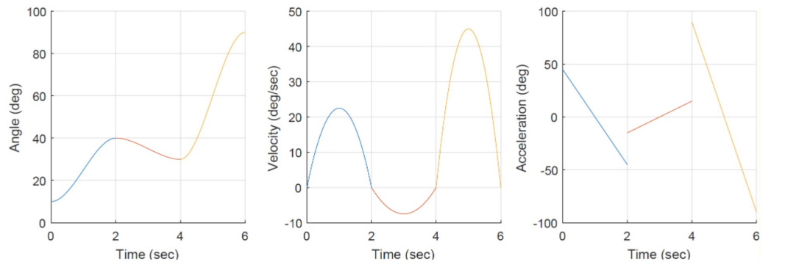
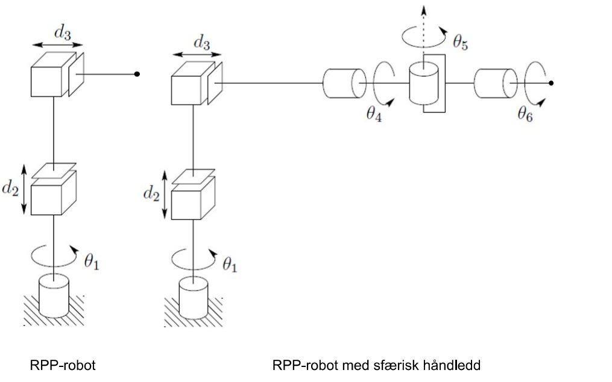

#### 1  Rotasjonsmatrisen på bildet under er ufullstendig. Benytt egenskapene til rotasjonsmatriser til å fylle inn de siste elementene. Svar skal oppgis med 4 desimaler, likt med resten av elementene (4%).

$$\begin{bmatrix}
? & 0.9659 & 0.2589 \\
? & -0.2241 & 0.8365 \\
0.8660 & -0.1294 & 0.4830
\end{bmatrix}$$

Vis svar

$0.0000$ og $-0.5000$

#### 2  Rotasjonsmatrisen på bildet representerer en simpel rotasjon rundt x-aksen med vinkel $\theta \in [0,\ \frac{\pi}{2}]$, men er ufullstendig. Benytt egenskapene til rotasjonsmatriser til å fylle inn de siste elementene. Svar skal oppgis med 4 desimaler, likt med resten av elementene.

$$\begin{bmatrix}
1.0000 & 0.0000 & 0.0000 \\
0.0000 & 0.8090 & ? \\
0.0000 & ? & 0.8090
\end{bmatrix}$$

Vis svar

$-0.5878$ og $0.5878$

#### 3  Gitt den sammensatte rotasjonen $R$ gitt av følgende sekvens av basisrotasjoner:

1. En rotasjon på $\phi$ rundt den aktuelle z-aksen.
2. En rotasjon på $\psi$ rundt den aktuelle x-aksen.
3. En rotasjon på $\alpha$ rundt verdens z-aksen.
4. En rotasjon på $\theta$ rundt verdens x-aksen.
5. En rotasjon på $\beta$ rundt den aktuelle x-aksen.
6. En rotasjon på $\eta$ rundt verdens y-aksen.

Hvilket av uttrykkene under tilsvarer samme rotasjon som $R$

Velg ett alternativ:

Vis svar

$R_{y,\eta} \cdot R_{x,\theta} \cdot R_{z,\alpha+\phi} \cdot R_{x,\psi+\beta}$.

1. $R_{y,\eta} \cdot R_{x,\theta+\psi+\beta} \cdot R_{z,\alpha+\phi}$  
2. $R_{y,\eta} \cdot R_{x,\theta} \cdot R_{z,\alpha} \cdot R_{x,\psi} \cdot R_{z,\phi} \cdot R_{x,\beta}$  
3. $R_{z,\phi} \cdot R_{x,\psi} \cdot R_{z,\alpha} \cdot R_{x,\theta} \cdot R_{x,\beta} \cdot R_{y,\eta}$  
4. $R_{y,\eta} \cdot R_{x,\theta} \cdot R_{z,\alpha+\phi} \cdot R_{x,\psi+\beta}$  
5. $R_{x,\psi+\beta} \cdot R_{z,\alpha+\phi} \cdot R_{x,\theta} \cdot R_{y,\eta}$  

#### 4  Gitt transformasjonsmatrisen og punktet under: Hvilke utsagn er riktig?

$$T^{0}_{1} =
\begin{bmatrix}
0 & 0 & 1 & 1\\
-1 & 0 & 0 & 2\\
0 & -1 & 0 & 3\\
0 & 0 & 0 & 1
\end{bmatrix},
\ \ 
p^{1} =
\begin{bmatrix}
1\\
3\\
1
\end{bmatrix}^{T}$$

Velg ett eller flere alternativer

Vis svar

Punkt $p^{1}$ sett fra referanserammen $o_{0}x_{0}y_{0}z_{0}$ er: $p^{0} = [2\ \ 1\ \ 0]^{T}$  
$o^{1}_{0}$ kan uttrykkes ved hjelp av $(T^{0}_{1})^{-1}o^{0}_{0}$

1 Punkt $p^{1}$ sett fra referanserammen $o_{0}x_{0}y_{0}z_{0}$ er: $p^{0} = [1\ \ -1\ \ -3]^{T}$  

2 $o^{0}_{0}$ kan uttrykkes med uttrykket $T^{0}_{1} o^{1}_{1}$  

3 Punkt $p^{1}$ sett fra referanserammen $o_{0}x_{0}y_{0}z_{0}$ er: $p^{0} = [2\ \ 1\ \ 0]^{T}$  

4 Avstanden fra $o_{0}$ til $o_{1}$ er $2\sqrt{7}$  

5 $o^{1}_{0}$ kan uttrykkes ved hjelp av $(T^{0}_{1})^{-1}o^{0}_{0}$  

#### 5  Det er generert en polynomisk bane til et roterende robotledd basert på et startpunkt, 2 viapunkter og et sluttpunkt for leddverdien. Hvilke av disse påstandene er riktige gitt grafen vi ser under?

Velg ett eller flere alternativer

Vis svar

2, 3, 4, 7.  
Grafane tyder på kontinuerleg vinkel og hastigheit, men hopp i akselerasjon ved via-punkta.

1. Polynomet er generert for å ha en bestemt akselerasjon i tidspunktene t = 2 og t = 4.  
2. Polynomene er generert for å ha en bestemt hastighet i tidspunktene t = 2 og t = 4.  
3. Hopp i akselerasjon gir en uheldig effekt, siden verdiene for rykk vil være veldig store.  
4. Banen har diskontinuiteter i akselerasjonen, noe som tyder på at genereringen ikke er fra kvintiske polynom  
5. Polynom generert basert på bestemte verdier for posisjon, fart og akselerasjon ved visse tidspunkt vil også legge begrensninger på hva disse tre verdiene kan være mellom tidspunktene.  
6. Banen har kontinuerlig deriverbar (glatt) vinkel, noe som betyr at det ikke vil være store endringer i rykk (derivert av hastighet)  
7. Banen har kontinuerlig hastighet, noe som antyder banegenerering fra kubiske polynom.  

#### 6  Hvilke av de følgende påstandene er sanne?

Velg ett eller flere alternativer

Vis svar

6, og truleg 2 og 8.  
6 er tydeleg riktig. 1, 4, 5, 7 verkar feil ut frå standard kameramodell og Otsu-prinsipp. 2 og 8 kan vere riktige avhengig av kva som er vektlagt i faget.  

1. I nålehullslinsemodellen projiserer man x- og z-aksen på bildeplanet, og lar y-aksen bestemme dybden i bildet.  
2. Kameraet kalibreres ved å sammenligne kontrollpunkt du ser på kameraet og samtidig kjenner absolutt posisjon på.  
3. I metoden vi har lært i faget brukes rekursjon for å redusere beregningsmengden for å finne optimal terskelverdi.  
4. Hvis du ser ett punkt i kameraet som du vet posisjonen på i verdensrammesystemet, kan du kalibrere kameraet med det.  
5. Hvis du finner et punkt på kameraet kan du med et godt kalibrert kamera finne posisjonen til punktet i verdensrammesystemet.  
6. Et bildehistogram av et gråskalabilde forteller hvor mange piksler det er som befinner seg innen visse intervaller av lysstyrke.  
7. Automatisk terskelvalg for å skille et bilde i to segmenter gjøres ved å maksimere innad-gruppevariansen i bildehistogrammet, slik at de to delene av histogrammet har størst mulig varians i sine respektive deler.  
8. Pikselkoordinatene til prinsipalpunktet ($O_r$ og $O_c$) finner man ved å bruke forsvinningspunktene i bildet.  

#### 7

1. Gitt RPP-roboten vist nederst i oppgaven: Tegn inn koordinatsystem i henhold til DH-konvensjonen og finn DH-parameterne. Lengden på hver lenke er 1. (10%)
2. Regn ut hva $^{0}_{3}T$, $^{0}_{2}T$ og $T^{0}_{1}$ blir. (8%)
3. Gitt samme robot: Regn ut hva $J(q)$ blir. (10%)
4. Gitt en ønsket kroppshastighet, $\xi^{*} = [v^{*T}\ \ \omega^{*T}]^{T}$, vis hvordan du kan finne $\dot{q}^{*}$ slik at $J(q)\dot{q}^{*} = \xi^{*}$. Er dette mulig? Diskuter om det er mulig og hva eventuelt problemet kan være. (6%)
5. Vi legger til et sfærisk zyz-håndledd på enden av RPP-roboten. Tegning er vist i bildet nederst i oppgaven. Hvordan vil dette påvirke invers hastighets kinematikk? (7%)
6. Fortell overordnet, uten å gjøre beregninger, hvordan man går frem for å løse inverskinematikkproblemet $q = f(p, R)$. (6%)
7. Vi skal nå bruke en annen generisk 9-ledds robotarm, hvorav de siste 3 leddene består av et sfærisk håndledd. Robotarmen er overaktuert og kan bevege, og orientere, seg fritt innenfor det aktuelle rommet for dette problemet. Oppgave robotarmen skal utføre krever at endeeffektoren står i ro. Siden den jobber i et trangt miljø, skjer det ofte at robotarmen likevel må flytte lenkene ut av veien for andre aktører i arbeidsområdet. Forklar hvordan dette kan løses rent kinematisk, og hvilke betingelser som må oppfylles for at det skal være mulig. (6%)

